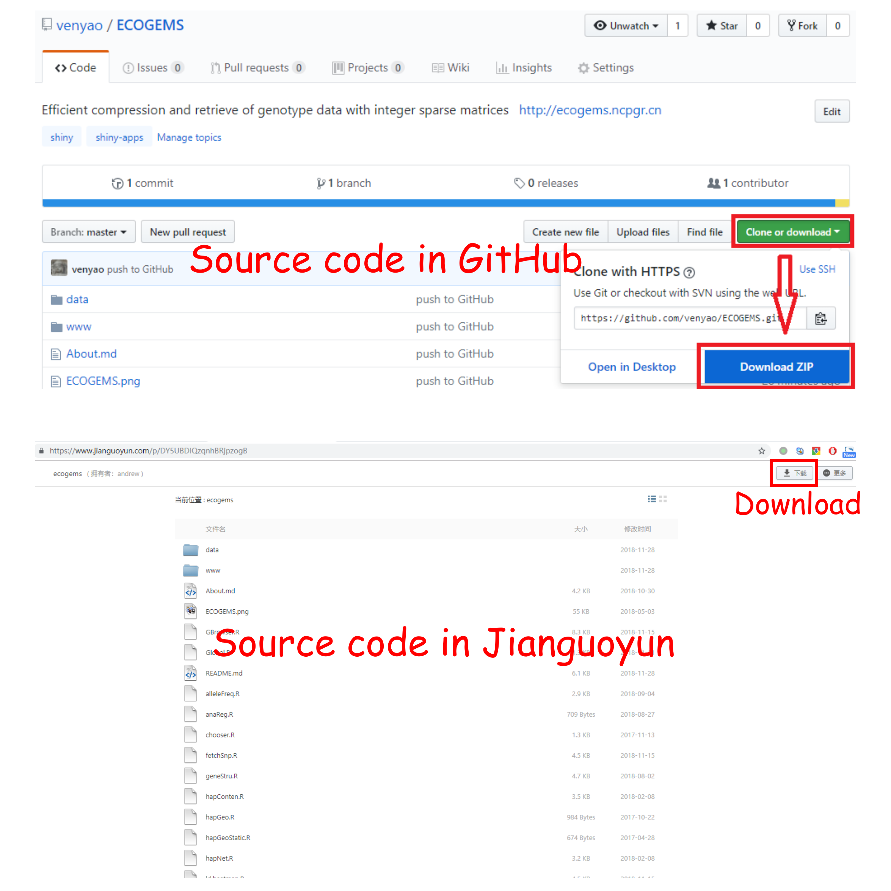

ECOGEMS
========

The genotypes of 2058 rice accessions at 8,584,244 SNP sites are stored using Sparse Matrices in R.  
For more information, please check our publicationin at <a href="https://doi.org/10.1093/bioinformatics/btz186" target="_blank">Bioinformatics</a>.  

*****

#	Use ECOGEMS online

ECOGEMS is deployed at <a href="http://ECOGEMS.ncpgr.cn/" target="_blank">http://ECOGEMS.ncpgr.cn/</a> and <a href="http://venyao.xyz/ECOGEMS/" target="_blank">http://venyao.xyz/ECOGEMS/</a> for online use.  
ECOGEMS is idle until you activate it by accessing the URL. So it may take some time when you access this URL for the first time. Once it was activated, ECOGEMS could be used smoothly and easily.  

*****

#	Launch ECOGEMS directly from R and GitHub

User can choose to run ECOGEMS installed locally for a more preferable experience.

**Step 1: Install R and RStudio**

Before running the app you will need to have R and RStudio installed (tested with R 3.4.4 and RStudio 1.1.442).  
Please check CRAN (<a href="https://cran.r-project.org/" target="_blank">https://cran.r-project.org/</a>) for the installation of R.  
Please check <a href="https://www.rstudio.com/" target="_blank">https://www.rstudio.com/</a> for the installation of RStudio.  

**Step 2: Install the R Shiny package and other packages required by ECOGEMS**

Start an R session using RStudio and run these lines:  
```
# try an http CRAN mirror if https CRAN mirror doesn't work  
install.packages("shiny")  
install.packages("shinyBS")  
install.packages("shinythemes")  
install.packages("shinycssloaders")
install.packages("plotly")  
install.packages("foreach")  
install.packages("ape")  
install.packages("pegas")  
install.packages("plyr")  
install.packages("dplyr")  
install.packages("ggmap")  
install.packages("tidyr")  
install.packages("gridExtra")   
install.packages("htmlwidgets")  
install.packages("BiocManager")  
BiocManager::install("IRanges")
BiocManager::install("snpStats")
BiocManager::install("chopsticks")  
BiocManager::install("ggtree")  
# try an http CRAN mirror if https CRAN mirror doesn't work  
install.packages("LDheatmap")  
# install shinysky  
install.packages("devtools")  
devtools::install_github("venyao/ShinySky", force=TRUE)  
```

**Step 3: Start the app**  

Start an R session using RStudio and run these lines:  
```
library(shiny)  
runGitHub("ECOGEMS", "venyao", launch.browser = TRUE)  
```
This command will download the code of ECOGEMS from GitHub to a temporary directory of your computer and then launch the ECOGEMS app in the web browser. Once the web browser was closed, the downloaded code of ECOGEMS would be deleted from your computer. Next time when you run this command in RStudio, it will download the source code of ECOGEMS from GitHub to a temporary directory again. This process is frustrating since it takes some time to download the code of ECOGEMS from GitHub.  

Users are suggested to download the source code of ECOGEMS from Jianguoyun (https://www.jianguoyun.com/p/DY5UBDIQzqnhBRjpzogB) or GitHub (https://github.com/venyao/ECOGEMS) to a fixed directory of your computer, such as 'E:\apps' on Windows. Following the procedure illustrated in the following figure, a zip file named 'ECOGEMS-master.zip' (GitHub) or 'ecogems.zip' (Jianguoyun) would be downloaded to the disk of your computer. Move this file to 'E:\apps' and unzip this file. Then a directory named 'ECOGEMS-master' or 'ecogems' would be generated in 'E:\apps'. The scripts 'server.R' and 'ui.R' could be found in 'E:\apps\ECOGEMS-master' or 'E:\apps\ecogems'.  
<br>
  
<br>

Then start an R session using RStudio and run these lines:  
```
library(shiny)  
runApp("E:/apps/ECOGEMS-master", launch.browser = TRUE)  # from GitHub
runApp("E:/apps/ecogems", launch.browser = TRUE)   # from Jianguoyun
# The first parameter of runApp should be the directory that contains the scripts server.R and ui.R of ECOGEMS.  
```

Your web browser will open the app.

*****

#	Deploy ECOGEMS on local or web Linux server

**Step 1: Install R**  

Please check CRAN (<a href="https://cran.r-project.org/" target="_blank">https://cran.r-project.org/</a>) for the installation of R.

**Step 2: Install the R Shiny package and other packages required by ECOGEMS**  

Start an R session and run these lines in R:  
```
# try an http CRAN mirror if https CRAN mirror doesn't work  
install.packages("shiny")  
install.packages("shinyBS")  
install.packages("shinythemes")  
install.packages("shinycssloaders")
install.packages("plotly")  
install.packages("foreach")  
install.packages("ape")  
install.packages("pegas")  
install.packages("plyr")  
install.packages("dplyr")  
install.packages("ggmap")  
install.packages("tidyr")  
install.packages("gridExtra")   
install.packages("htmlwidgets")  
install.packages("BiocManager")  
BiocManager::install("IRanges")
BiocManager::install("snpStats")
BiocManager::install("chopsticks")  
BiocManager::install("ggtree")  
# try an http CRAN mirror if https CRAN mirror doesn't work  
install.packages("LDheatmap")  
# install shinysky  
install.packages("devtools")  
devtools::install_github("venyao/ShinySky", force=TRUE)   
```

For more information, please check the following pages:  
<a href="https://cran.r-project.org/web/packages/shiny/index.html" target="_blank">https://cran.r-project.org/web/packages/shiny/index.html</a>  
<a href="https://github.com/rstudio/shiny" target="_blank">https://github.com/rstudio/shiny</a>  
<a href="https://shiny.rstudio.com/" target="_blank">https://shiny.rstudio.com/</a>  

**Step 3: Install Shiny-Server**

Please check the following pages for the installation of shiny-server.  
<a href="https://www.rstudio.com/products/shiny/download-server/" target="_blank">https://www.rstudio.com/products/shiny/download-server/</a>  
<a href="https://github.com/rstudio/shiny-server/wiki/Building-Shiny-Server-from-Source" target="_blank">https://github.com/rstudio/shiny-server/wiki/Building-Shiny-Server-from-Source</a>  

**Step 4: Upload files of ECOGEMS**

Put the directory containing the code and data of ECOGEMS to /srv/shiny-server.  

**Step 5: Configure shiny server (/etc/shiny-server/shiny-server.conf)**

```
# Define the user to spawn R Shiny processes
run_as shiny;

# Define a top-level server which will listen on a port
server {  
  # Use port 3838  
  listen 3838;  
  # Define the location available at the base URL  
  location /ecogems {  
    # Directory containing the code and data of ECOGEMS  
    app_dir /srv/shiny-server/ECOGEMS;  
    # Directory to store the log files  
    log_dir /var/log/shiny-server;  
  }  
}  
```

**Step 6: Change the owner of the ECOGEMS directory**

```
$ chown -R shiny /srv/shiny-server/ECOGEMS  
```

**Step 7: Start Shiny-Server**

```
$ start shiny-server  
```

Now, the ECOGEMS app is available at http://IPAddressOfTheServer:3838/ECOGEMS/.  


